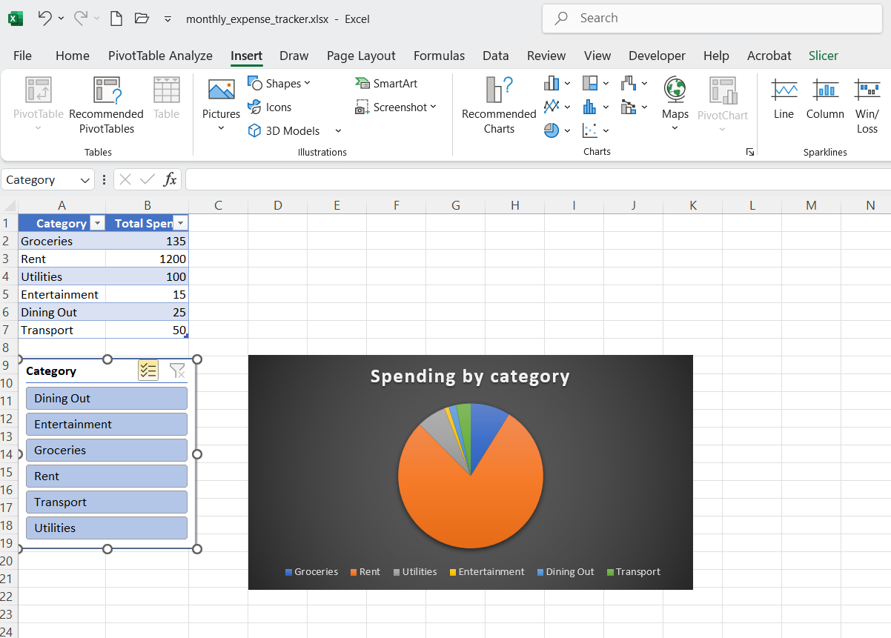

# 💰 Monthly Expense Tracker (Excel Project)

## 📌 Overview
This is a beginner-friendly Microsoft Excel project designed to help individuals manage and track personal monthly expenses. It uses basic formulas and charts to provide clear visual insights into spending habits.

## 🛠 Tools Used
- Microsoft Excel
- Tables
- SUMIF formula
- Pie/Bar Charts
- Slicers (optional)

## 📈 Features
- Input table for tracking daily expenses
- Automatic category-wise expense summary using `SUMIF`
- Interactive pie chart showing spending distribution
- Clean, simple dashboard format

## 🗂 Files Included
- `monthly_expense_tracker.xlsx`
- `README.md`

  ## 📷 Screenshot
      

## 💡 Learning Outcome
This project demonstrates how to use Excel for simple personal finance management using basic but powerful features.

## 🔗 GitHub Repository
[https://github.com/your-username/monthly-expense-tracker](https://github.com/maheswari1997-wq/excel-expense-tracker)
